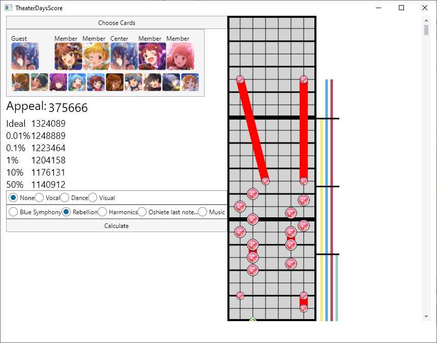
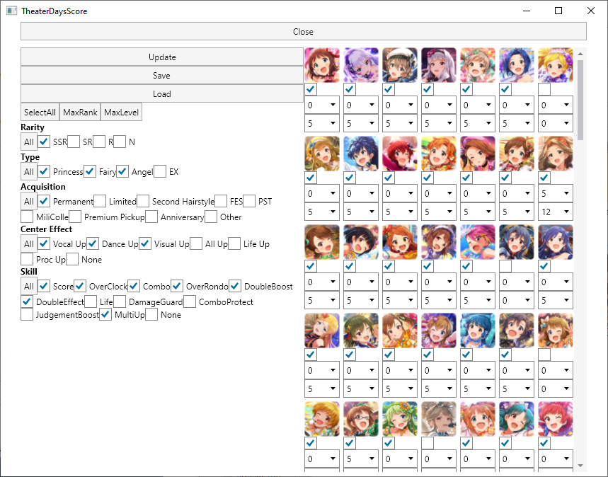
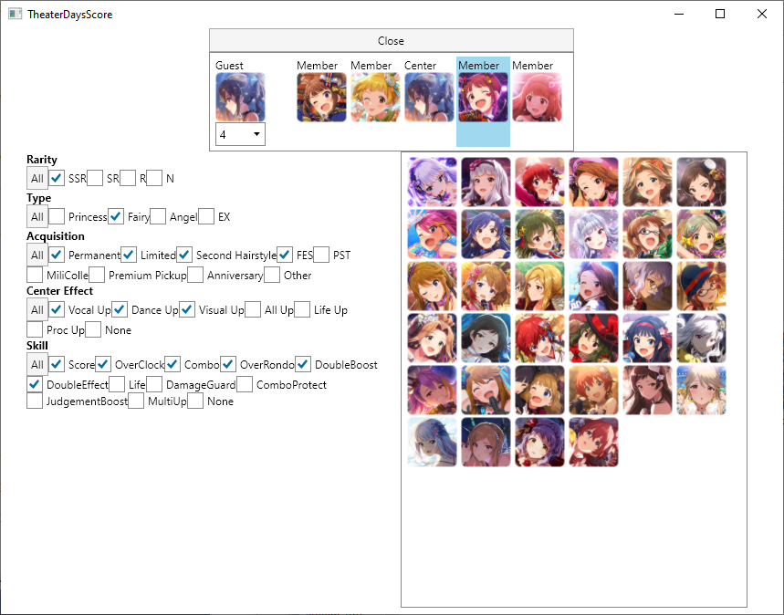

# Theater Days Score

This is a simple desktop app built with [Avalonia](https://www.avaloniaui.net/) and [Reactive UI](https://www.reactiveui.net/), designed to help players of the mobile game [_The iDOLM@STER Million Live! Theater Days_](https://millionlive.idolmaster.jp/theaterdays/). _Theater Days_ is a rhythm game where your score is dependent on what cards you build your unit with when playing songs. Different cards have different strengths and skills, so simulating different combinations of cards can help find the optimal unit.

### Cards

Card data is retrieved on demand via [matsurihi.me](https://matsurihi.me)'s [Princess API](https://api.matsurihi.me/docs/). Simply go to the [deck building](#deck-bulding-screen) screen and select "Update".

### Songs

Song data is currently hard coded to five songs, at least one of each type:

* All: _MUSIC♪_
* Princess: _Rebellion_
* Fairy: _Blue Symphony_, _Harmonics_
* Angel: _Oshiete last note..._

## Preview

### Scoring Screen

Select "Choose Cards" to go to the deck builder. Select the block below to go to the unit builder.

The first toggle block sets the event attribute boost, and the one below that sets the song. The preview panel on the right will show you the beat map for the selected song, as well as all the potential activation periods for each unit member's skill, colour coded to the character's image colour. The black bars of the skill activation section indicate whole seconds.

Select "Calculate" to run the score simulation.

### Deck Building Screen

Select "Close" to return to the scoring screen.

Select "Update" to download the latest card info. "Save" will persist your deck modifications for the next time the app is opened, and "Load" will reset them to the previously saved state. Modifications made here and not saved will take effect across the other screens, but only until the app is closed.

The check under each card indicates if you posses that card. The first dropdown is for the card's master rank, while the second is for the card's skill level.

Choose "SelectAll" to set the possession check for all cards that match the current filters. "MaxRank" will set all cards matching the filters to their maximum master rank, and "MaxLevel" will do the same for the maximum skill level.

For the filters, the "All" button will either check all options for that category, or if all are already selected, will uncheck all the options. Individual options can then be toggled as desired.

### Unit Building Screen

Select "Close" to return to the scoring screen.

Selecting each of the positions in the unit panel will bring up the list of cards that match your current filters. Positions other than the guest slot are additionally filtered to only cards you possess, as determined by the deck builder selections. The dropdown under the guest allows you to select their master rank. Once a position is selected, click on one of the cards in the filtered list to place it in that position.

For the filters, the "All" button will either check all options for that category, or if all are already selected, will uncheck all the options. Individual options can then be toggled as desired.